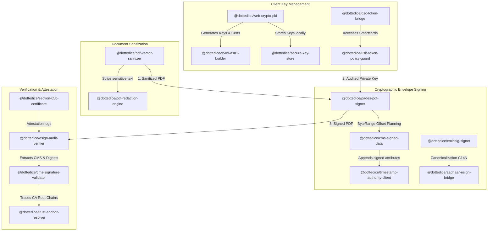

## Legal Terms & Disclaimer
This open-source package is distributed strictly for technical education and architectural research purposes. 
For full warranty disclaimers, export control notices (US EAR / EU Dual-Use), and limitation of liability terms, please review our [Open Source Terms & Disclaimer](https://dottedice.com/open-source-terms.html).
---


# DottedIce Cryptographic Monorepo (Open-Source Verification Shield)

A modular, high-performance, and offline-first client-side digital signature and privacy compliance monorepo. Formulates a complete trust shield utilizing the native Web Cryptography API.

---

## 🗺️ Architectural Interlink Grid

The following diagram illustrates how the 16 packages interlink to build an end-to-end secure document processing workflow:



---

## 📦 Monorepo Packages

| Package | Version | Goal | Primary Compliance |
| :--- | :--- | :--- | :--- |
| **[`@dottedice/web-crypto-pki`](file:///Users/sundarakamatchis/Downloads/DottedIce/Community/open-source-cryptography/web-crypto-pki)** | `v1.0.0` | Browser keypair generator and self-signed X.509 cert exporter. | RFC 5280 |
| **[`@dottedice/pades-pdf-signer`](file:///Users/sundarakamatchis/Downloads/DottedIce/Community/open-source-cryptography/pades-pdf-signer)** | `v1.0.0` | Adobe-compliant byte-range PDF signature injector. | PAdES / PDF 1.7 |
| **[`@dottedice/esign-audit-verifier`](file:///Users/sundarakamatchis/Downloads/DottedIce/Community/open-source-cryptography/esign-audit-verifier)** | `v1.0.2` | Extracts byte ranges, checks integrity, and logs system metadata. | Evidence Act Sec 65B |
| **[`@dottedice/x509-asn1-builder`](file:///Users/sundarakamatchis/Downloads/DottedIce/Community/open-source-cryptography/x509-asn1-builder)** | `v1.0.0` | Low-level DER ASN.1 encoder for cert elements. | ASN.1 DER / RFC 5280 |
| **[`@dottedice/cms-signed-data`](file:///Users/sundarakamatchis/Downloads/DottedIce/Community/open-source-cryptography/cms-signed-data)** | `v1.0.0` | Formats PKCS#7 CMS SignedData detached envelopes. | CMS (RFC 5652) |
| **[`@dottedice/cms-signature-validator`](file:///Users/sundarakamatchis/Downloads/DottedIce/Community/open-source-cryptography/cms-signature-validator)** | `v1.0.0` | Cryptographically validates signatures over CMS SignedAttributes. | PKCS#7 verification |
| **[`@dottedice/pdf-vector-sanitizer`](file:///Users/sundarakamatchis/Downloads/DottedIce/Community/open-source-cryptography/pdf-vector-sanitizer)** | `v1.0.0` | Strips raw text streams completely to prevent copy-paste data leaks. | GDPR / DPDP Act 2023 |
| **[`@dottedice/usb-token-policy-guard`](file:///Users/sundarakamatchis/Downloads/DottedIce/Community/open-source-cryptography/usb-token-policy-guard)** | `v1.0.0` | Filters CCID APDUs to block proprietary diagnostic backdoors. | ISO/IEC 7816-4 |
| **[`@dottedice/trust-anchor-resolver`](file:///Users/sundarakamatchis/Downloads/DottedIce/Community/open-source-cryptography/trust-anchor-resolver)** | `v1.0.0` | Verifies certificate chain paths to CA Root stores. | AATL / eIDAS |
| **[`@dottedice/timestamp-authority-client`](file:///Users/sundarakamatchis/Downloads/DottedIce/Community/open-source-cryptography/timestamp-authority-client)** | `v1.0.0` | HTTP timestamp query generator for secure LTV. | RFC 3161 |
| **[`@dottedice/secure-key-store`](file:///Users/sundarakamatchis/Downloads/DottedIce/Community/open-source-cryptography/secure-key-store)** | `v1.0.0` | PBKDF2/AES-GCM encrypted local key storage wrapper. | OWASP Client Storage |
| **[`@dottedice/aadhaar-esign-bridge`](file:///Users/sundarakamatchis/Downloads/DottedIce/Community/open-source-cryptography/aadhaar-esign-bridge)** | `v1.0.0` | SOAP/XML gateway query client for remote eSign services. | CCA India eSign v2.1 |
| **[`@dottedice/xmldsig-signer`](file:///Users/sundarakamatchis/Downloads/DottedIce/Community/open-source-cryptography/xmldsig-signer)** | `v1.0.0` | Exclusive canonicalization and enveloped XML signer. | W3C XMLDSig |
| **[`@dottedice/section-65b-certificate`](file:///Users/sundarakamatchis/Downloads/DottedIce/Community/open-source-cryptography/section-65b-certificate)** | `v1.0.0` | Generates admissibility legal attestation forms. | Section 65B Act |
| **[`@dottedice/dsc-token-bridge`](file:///Users/sundarakamatchis/Downloads/DottedIce/Community/open-source-cryptography/dsc-token-bridge)** | `v1.0.0` | CCID APDU transport bridge using WebUSB. | CCID smartcards |
| **[`@dottedice/pdf-redaction-engine`](file:///Users/sundarakamatchis/Downloads/DottedIce/Community/open-source-cryptography/pdf-redaction-engine)** | `v1.0.0` | Applies visual coordinate masking blocks. | Visual Obfuscation |

---

## ⚡ Quick Start: Composing a Secure Signature Workflow

Here is how a developer can compose these packages to sanitize, sign, and verify a PDF document:

```js
import { generateKeyPair, generateX509Certificate } from '@dottedice/web-crypto-pki';
import { sanitizePdfText } from '@dottedice/pdf-vector-sanitizer';
import { signPdf } from '@dottedice/pades-pdf-signer';
import { verifySignature } from '@dottedice/esign-audit-verifier';
import { verifyCMSSignature } from '@dottedice/cms-signature-validator';
import { buildName } from '@dottedice/x509-asn1-builder';

// 1. Setup Keys and Certificates
const keyPair = await generateKeyPair('RSA');
const certResult = await generateX509Certificate({ commonName: 'Vikram' }, keyPair);

// 2. Sanitize and Strip sensitive strings (DPDP Act Compliance)
const originalPdfBytes = /* ... load PDF ... */;
const sanitizedPdfBytes = await sanitizePdfText(originalPdfBytes, ['9876543210']);

// 3. Inject True PAdES ByteRange Signature
const signedPdfBytes = await signPdf(sanitizedPdfBytes, {
  signatoryName: 'Vikram Sharma',
  privateKey: keyPair.privateKey,
  signerCertificateDer: certResult.der,
  signerIssuerNameDer: buildName({ commonName: 'Vikram' }),
  signerSerialNumberHex: certResult.serialNumber
});

// 4. Extract and Validate Envelope Cryptographically
const integrity = await verifySignature(signedPdfBytes);
console.log('Document altered:', !integrity.isValid); // checks byte range hashes
```

---

## ⚖️ License
Licensed under the Apache License, Version 2.0. Conforms to patents grant and open-source compliance requirements.
